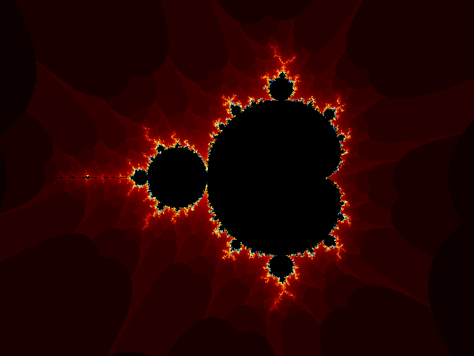
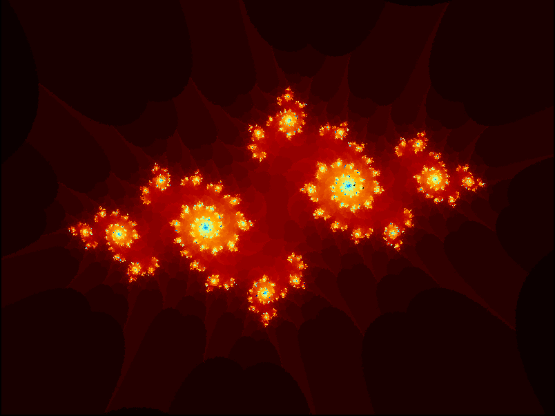
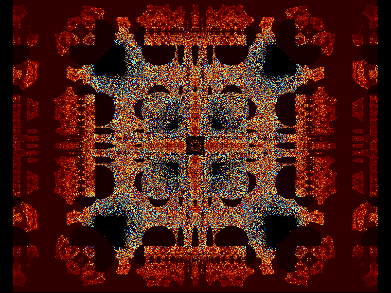
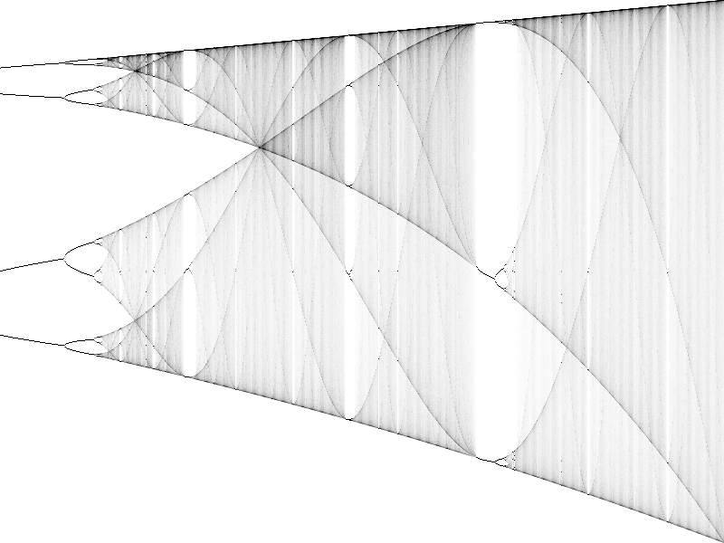
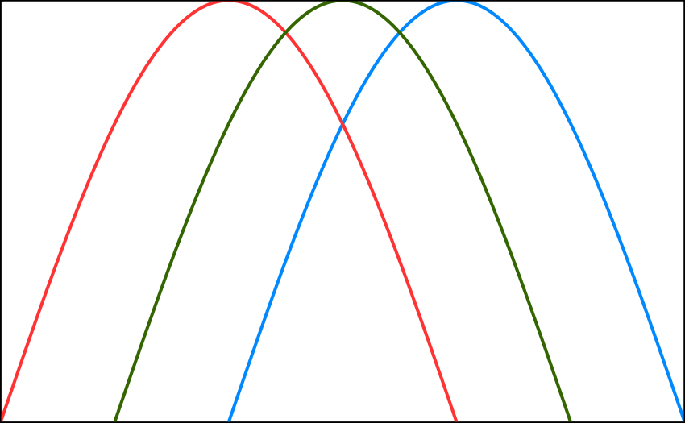

# A simple mandelbrot/julia/mandelbox/logistic map renderer

## Controls
| action                            | key(s)        |
| --------------------------------- | ------------- |
| quit                              | q             |
| move around                       | arrow keys    |
| zoom in/out                       | + / -         |
| pause/resume rendering            | space         |
| cycle through fractals            | f             |
| reset parameters                  | r             |
| increase/decrease rendering depth | . / ,         |
| move julia constant               | w / a / s / d |
| toggle color                      | c             |

## Example renderings

The color distribution for red, green and blue is as follows:

The X axis represents the amount of iterations it took for a mandelbrot series to escape the set threshold, depending on the depth.
The Y axis represents the value of the color component (red, green, or blue).
